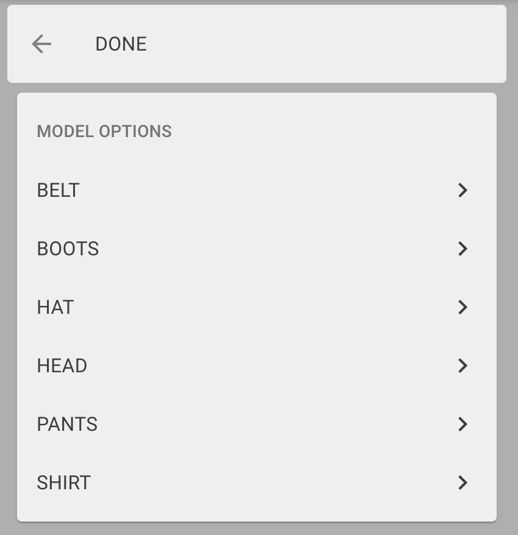

# Asset preparation
Demo uses [glTF](https://www.khronos.org/gltf/) format for loading models.

For model preparation [Blender](https://www.blender.org/) is used, any similar software with option to export glTF format can be used.

Steps:
1. Create model in your preferred modeling software
2. Use [Mixamo](https://www.mixamo.com/) for model rigging
3. Use [Blender](https://www.blender.org/) to correctly name optional and selectable elements.
4. Export glTF from Blender
5. [Test model](https://gljubojevic.github.io/3dprint-demo) drag&drop to check.

This doc will describe only export process and steps needed for model to be usable in demo.

## About models
Each model has all skinned meshes packed into single glTF file.
Usually model consists of:
- Main parts (always visible)
- Optional parts (selectable)

### Main parts
All main parts for mesh name MUST have prefix `main_` e.g.
- main_torso
- main_legs
- main_hands
- etc...

### Optional parts
Optional parts parts are divided into categories that are displayed in UI for model customization.  
  

Further there are two types of optional parts
- single item from same category can be visible
- multiple items from same category can be visible

To support optional parts selection naming convention is used for meshes, each name has three parts separeted by "_":
1. prefix is either
	- `opts` for single selectable meshes in category
	- `òptm` for multi selectable meshes in category
2. category name
3. mesh name

Format for name
```
[opts/optm]_[category]_[mesh]
````
WARN: **DO NOT USE SPACES** in mesh names

Example naming meshes **where single is selectable** in category
- opts_head_commander
- opts_head_solider
- opts_head_general

In category "head" it is possible to select either commander, solider or general but not all.  
**NOTE:** when single item is selectable first option is always visible by default.

Example naming meshes **where multiple is selectable** in category
- optm_accessories_belt
- optm_accessories_flask
- optm_accessories_bag

In category "accessories" it is possible to all options belt, flask and bag.  
**NOTE:** when multiple items are selectable none is visible by default.

## glTF Export process